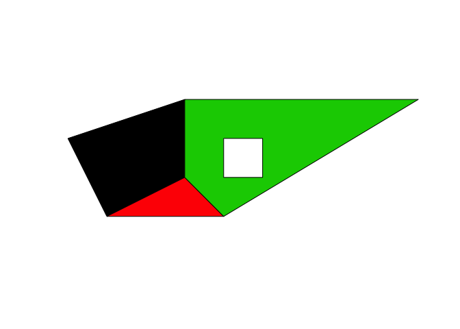
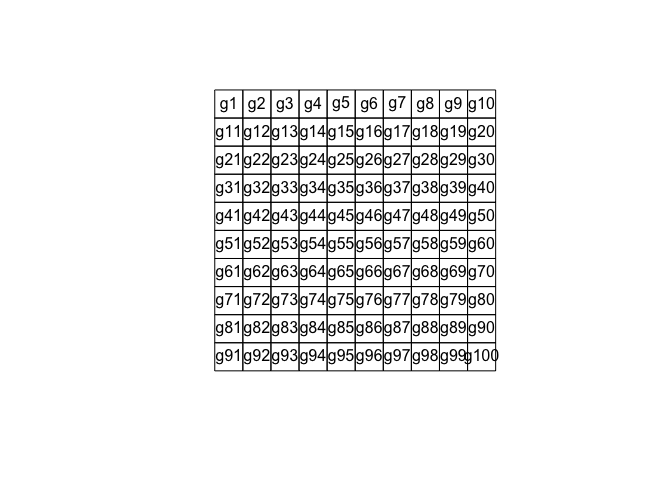

sp
================

  - [CRS](#crs)
  - [SpatialPoints](#spatialpoints)
      - [SpatialPointsDataFrame](#spatialpointsdataframe)
  - [SpatialLines](#spatiallines)
      - [SpatialLinesDataFrame](#spatiallinesdataframe)
  - [SpatialPolygons](#spatialpolygons)
      - [SpatialPolygonsDataFrame](#spatialpolygonsdataframe)

-----

``` r
library(sp)
```

-----

## CRS

-----

## SpatialPoints

S4 class with three slots:

  - coords
  - bbox
  - proj4string

<!-- end list -->

``` r
coords = cbind(x = round(runif(10), 2), 
               y = round(runif(10), 2))
head(coords)
#         x    y
# [1,] 0.23 0.72
# [2,] 0.69 0.02
# [3,] 0.29 0.10
# [4,] 0.65 0.65
# [5,] 0.86 0.49
# [6,] 0.44 0.90
```

``` r
spoints = SpatialPoints(coords)
spoints
# SpatialPoints:
#          x    y
#  [1,] 0.23 0.72
#  [2,] 0.69 0.02
#  [3,] 0.29 0.10
#  [4,] 0.65 0.65
#  [5,] 0.86 0.49
#  [6,] 0.44 0.90
#  [7,] 0.92 0.08
#  [8,] 0.83 0.05
#  [9,] 0.72 0.33
# [10,] 0.30 0.78
# Coordinate Reference System (CRS) arguments: NA
```

``` r
slotNames(spoints)
# [1] "coords"      "bbox"        "proj4string"
```

``` r
spoints@coords
#          x    y
#  [1,] 0.23 0.72
#  [2,] 0.69 0.02
#  [3,] 0.29 0.10
#  [4,] 0.65 0.65
#  [5,] 0.86 0.49
#  [6,] 0.44 0.90
#  [7,] 0.92 0.08
#  [8,] 0.83 0.05
#  [9,] 0.72 0.33
# [10,] 0.30 0.78
```

``` r
spoints@bbox
#    min  max
# x 0.23 0.92
# y 0.02 0.90
```

``` r
spoints@proj4string
# CRS arguments: NA
```

``` r
plot(spoints, pch = 2, axes = TRUE)
```

<!-- -->

### SpatialPointsDataFrame

``` r
df = data.frame(z = round(5 + rnorm(10), 2))
spoints_df = SpatialPointsDataFrame(spoints, df)
spoints_df
#     coordinates    z
# 1  (0.23, 0.72) 4.40
# 2  (0.69, 0.02) 5.28
# 3   (0.29, 0.1) 4.65
# 4  (0.65, 0.65) 6.73
# 5  (0.86, 0.49) 5.60
# 6   (0.44, 0.9) 4.03
# 7  (0.92, 0.08) 4.18
# 8  (0.83, 0.05) 5.45
# 9  (0.72, 0.33) 3.85
# 10  (0.3, 0.78) 6.45
```

-----

## SpatialLines

### SpatialLinesDataFrame

-----

## SpatialPolygons

``` r
Sr1 = Polygon(cbind(c(2,4,4,1,2),c(2,3,5,4,2)))
Sr2 = Polygon(cbind(c(5,4,2,5),c(2,3,2,2)))
Sr3 = Polygon(cbind(c(4,4,5,10,4),c(5,3,2,5,5)))
Sr4 = Polygon(cbind(c(5,6,6,5,5),c(4,4,3,3,4)), hole = TRUE)

Srs1 = Polygons(list(Sr1), "s1")
Srs2 = Polygons(list(Sr2), "s2")
Srs3 = Polygons(list(Sr3, Sr4), "s3/4")
SpP = SpatialPolygons(list(Srs1,Srs2,Srs3), 1:3)
plot(SpP, col = 1:3, pbg="white")
```

<!-- -->

``` r

grd <- GridTopology(c(1,1), c(1,1), c(10,10))
polys <- as(grd, "SpatialPolygons")
plot(polys)
text(coordinates(polys), labels=row.names(polys))
```

<!-- -->

### SpatialPolygonsDataFrame
