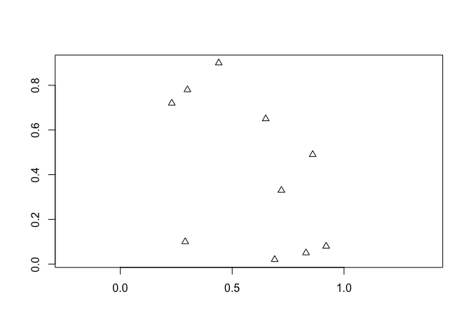

sp
================

  - [CRS](#crs)
  - [SpatialPoints](#spatialpoints)
      - [SpatialPointsDataFrame](#spatialpointsdataframe)
  - [SpatialLines](#spatiallines)
      - [SpatialLinesDataFrame](#spatiallinesdataframe)
  - [SpatialPolygons](#spatialpolygons)
      - [SpatialPolygonsDataFrame](#spatialpolygonsdataframe)
  - [GridTopology](#gridtopology)

-----

## CRS

-----

## SpatialPoints

S4 class with three slots:

  - coords
  - bbox
  - proj4string

<!-- end list -->

``` r
coords = cbind(x = c(0,0,1,1),
               y = c(0,1,0,1))
row.names(coords) = letters[1:4]
```

``` r
spoints = SpatialPoints(coords = coords, 
                        proj4string = CRS("+init=epsg:4227"))
spoints
# SpatialPoints:
#   x y
# a 0 0
# b 0 1
# c 1 0
# d 1 1
# Coordinate Reference System (CRS) arguments: +init=epsg:4227
# +proj=longlat +a=6378249.2 +b=6356515
# +towgs84=-190.421,8.532,238.69,0,0,0,0 +no_defs
```

``` r
slotNames(spoints)
# [1] "coords"      "bbox"        "proj4string"
```

``` r
spoints@coords
#   x y
# a 0 0
# b 0 1
# c 1 0
# d 1 1
```

``` r
spoints@bbox
#   min max
# x   0   1
# y   0   1
```

``` r
spoints@proj4string
# CRS arguments:
#  +init=epsg:4227 +proj=longlat +a=6378249.2 +b=6356515
# +towgs84=-190.421,8.532,238.69,0,0,0,0 +no_defs
```

``` r
summary(spoints)
# Object of class SpatialPoints
# Coordinates:
#   min max
# x   0   1
# y   0   1
# Is projected: FALSE 
# proj4string :
# [+init=epsg:4227 +proj=longlat +a=6378249.2 +b=6356515
# +towgs84=-190.421,8.532,238.69,0,0,0,0 +no_defs]
# Number of points: 4
```

``` r
plot(spoints, pch = 15, col = "blue", axes = FALSE)
```



### SpatialPointsDataFrame

``` r
df = data.frame(z = 1:length(spoints))
row.names(df) = row.names(spoints)
spoints_df = SpatialPointsDataFrame(spoints, df)
spoints_df
#   coordinates z
# a      (0, 0) 1
# b      (0, 1) 2
# c      (1, 0) 3
# d      (1, 1) 4
```

``` r
plot(spoints_df, 
     pch = spoints_df@data$z, 
     col = spoints_df@data$z, 
     axes = FALSE)
```


-----

## SpatialLines

  - a list of `Lines` objects
  - each `Lines` object is a list of `Line` objects

<!-- end list -->

``` r
L1 = Line(cbind(x = c(-1,-1,1,1), y = c(-1,1,1,-1)))
L2 = Line(cbind(x = c(-2,-2,2,2), y = c(-2,2,2,-2)))
Ls1 = Lines(list(L1), ID = "Ls1") # list can contain multiple Line objects
Ls2 = Lines(list(L2), ID = "Ls2") # list can contain multiple Line objects
slines = SpatialLines(LinesList = list(Ls1, Ls2), 
                      proj4string = CRS("+init=epsg:4227"))
```

``` r
slotNames(slines)
# [1] "lines"       "bbox"        "proj4string"
```

``` r
str(slines@lines)
# List of 2
#  $ :Formal class 'Lines' [package "sp"] with 2 slots
#   .. ..@ Lines:List of 1
#   .. .. ..$ :Formal class 'Line' [package "sp"] with 1 slot
#   .. .. .. .. ..@ coords: num [1:4, 1:2] -1 -1 1 1 -1 1 1 -1
#   .. .. .. .. .. ..- attr(*, "dimnames")=List of 2
#   .. .. .. .. .. .. ..$ : NULL
#   .. .. .. .. .. .. ..$ : chr [1:2] "x" "y"
#   .. ..@ ID   : chr "Ls1"
#  $ :Formal class 'Lines' [package "sp"] with 2 slots
#   .. ..@ Lines:List of 1
#   .. .. ..$ :Formal class 'Line' [package "sp"] with 1 slot
#   .. .. .. .. ..@ coords: num [1:4, 1:2] -2 -2 2 2 -2 2 2 -2
#   .. .. .. .. .. ..- attr(*, "dimnames")=List of 2
#   .. .. .. .. .. .. ..$ : NULL
#   .. .. .. .. .. .. ..$ : chr [1:2] "x" "y"
#   .. ..@ ID   : chr "Ls2"
```

``` r
str(slines@lines[[1]]@Lines)
# List of 1
#  $ :Formal class 'Line' [package "sp"] with 1 slot
#   .. ..@ coords: num [1:4, 1:2] -1 -1 1 1 -1 1 1 -1
#   .. .. ..- attr(*, "dimnames")=List of 2
#   .. .. .. ..$ : NULL
#   .. .. .. ..$ : chr [1:2] "x" "y"
```

``` r
slines@lines[[1]]@Lines[[1]]@coords
#       x  y
# [1,] -1 -1
# [2,] -1  1
# [3,]  1  1
# [4,]  1 -1
```

``` r
slines@bbox
#   min max
# x  -2   2
# y  -2   2
```

``` r
slines@proj4string
# CRS arguments:
#  +init=epsg:4227 +proj=longlat +a=6378249.2 +b=6356515
# +towgs84=-190.421,8.532,238.69,0,0,0,0 +no_defs
```

``` r
summary(slines)
# Object of class SpatialLines
# Coordinates:
#   min max
# x  -2   2
# y  -2   2
# Is projected: FALSE 
# proj4string :
# [+init=epsg:4227 +proj=longlat +a=6378249.2 +b=6356515
# +towgs84=-190.421,8.532,238.69,0,0,0,0 +no_defs]
```

``` r
plot(slines, col = c("red", "blue"), axes = FALSE)
```


### SpatialLinesDataFrame

``` r
df = data.frame(z = 1:length(slines))
row.names(df) = row.names(slines)
slines_df = SpatialLinesDataFrame(slines, df)
str(slines_df)
# Formal class 'SpatialLinesDataFrame' [package "sp"] with 4 slots
#   ..@ data       :'data.frame':   2 obs. of  1 variable:
#   .. ..$ z: int [1:2] 1 2
#   ..@ lines      :List of 2
#   .. ..$ :Formal class 'Lines' [package "sp"] with 2 slots
#   .. .. .. ..@ Lines:List of 1
#   .. .. .. .. ..$ :Formal class 'Line' [package "sp"] with 1 slot
#   .. .. .. .. .. .. ..@ coords: num [1:4, 1:2] -1 -1 1 1 -1 1 1 -1
#   .. .. .. .. .. .. .. ..- attr(*, "dimnames")=List of 2
#   .. .. .. .. .. .. .. .. ..$ : NULL
#   .. .. .. .. .. .. .. .. ..$ : chr [1:2] "x" "y"
#   .. .. .. ..@ ID   : chr "Ls1"
#   .. ..$ :Formal class 'Lines' [package "sp"] with 2 slots
#   .. .. .. ..@ Lines:List of 1
#   .. .. .. .. ..$ :Formal class 'Line' [package "sp"] with 1 slot
#   .. .. .. .. .. .. ..@ coords: num [1:4, 1:2] -2 -2 2 2 -2 2 2 -2
#   .. .. .. .. .. .. .. ..- attr(*, "dimnames")=List of 2
#   .. .. .. .. .. .. .. .. ..$ : NULL
#   .. .. .. .. .. .. .. .. ..$ : chr [1:2] "x" "y"
#   .. .. .. ..@ ID   : chr "Ls2"
#   ..@ bbox       : num [1:2, 1:2] -2 -2 2 2
#   .. ..- attr(*, "dimnames")=List of 2
#   .. .. ..$ : chr [1:2] "x" "y"
#   .. .. ..$ : chr [1:2] "min" "max"
#   ..@ proj4string:Formal class 'CRS' [package "sp"] with 1 slot
#   .. .. ..@ projargs: chr "+init=epsg:4227 +proj=longlat +a=6378249.2 +b=6356515 +towgs84=-190.421,8.532,238.69,0,0,0,0 +no_defs"
```

-----

## SpatialPolygons

``` r
P1 = Polygon(cbind(x = c(-1,-1,1,1), y = c(-1,1,1,-1)))
P2 = Polygon(cbind(x = c(-2,-2,2,2), y = c(-2,2,2,-2)))
Ps1 = Polygons(list(P1), ID = "Ps1") # list can contain multiple Polygon objects
Ps2 = Polygons(list(P2), ID = "Ps2") # list can contain multiple Polygon objects
spoly = SpatialPolygons(Srl = list(Ps1, Ps2), 
                        pO = 2:1, 
                        proj4string = CRS("+init=epsg:4227"))
```

``` r
plot(spoly, col = 2:3, pbg = "white")
```


### SpatialPolygonsDataFrame

-----

## GridTopology

``` r
sgrid <- GridTopology(c(0,0), c(1,1), c(10,10))
sgrid_poly <- as(sgrid, "SpatialPolygons")
plot(sgrid_poly, axes = TRUE)
text(coordinates(sgrid_poly), labels = row.names(sgrid_poly))
```


