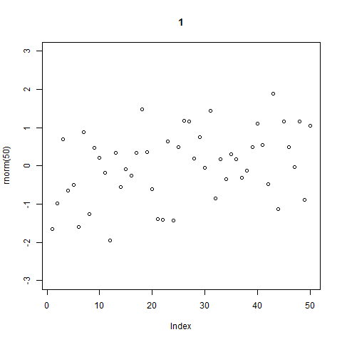

Title
========================================================

<a id="top">**Top**</a> 

This is an R Markdown document. Markdown is a simple formatting syntax for authoring web pages (click the **MD** toolbar button for help on Markdown).

When you click the **Knit HTML** button a web page will be generated that includes both content as well as the output of any embedded R code chunks within the document. You can embed an R code chunk like this:

```{r}
summary(cars)
```

You can also embed plots, for example:

```{r fig.width=7, fig.height=6}
plot(cars)
```

Here's an inline equation: $y_i = \alpha + \beta x_i + e_i$

And a free-standing equation:

$$
  \begin{aligned}
  \dot{x} & = \sigma(y-x) \\
  \end{aligned}
$$

Here's a link to <a href="http://www.google.com">Google</a>.

Here's a link to <a href="http://www.google.com" target="_blank">Google</a> that opens a new window. 

Here's one to another page:
<a href="page b.html">Click here to go to page b.</a> 


g

g

g

g

g

g

g

g

g

g

g

g

g

g

g

g

g

g

g

g

g

Section links work in markdown too:
<a href="#top">go to top</a> 

And here a link to an animation save as an html file:

<a href="anim_norm.html" target="_blank">Click here to go to the animation.</a> 

And here's an embedded gif:

.

